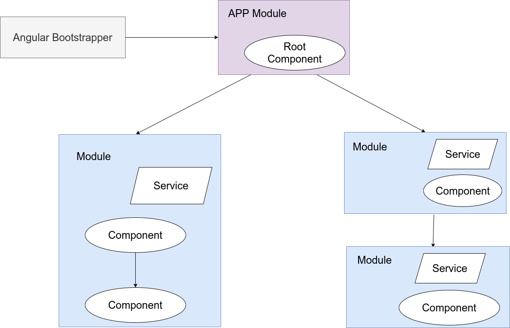
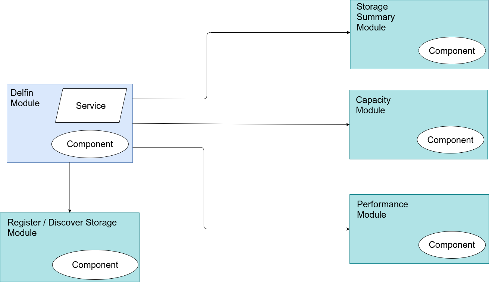
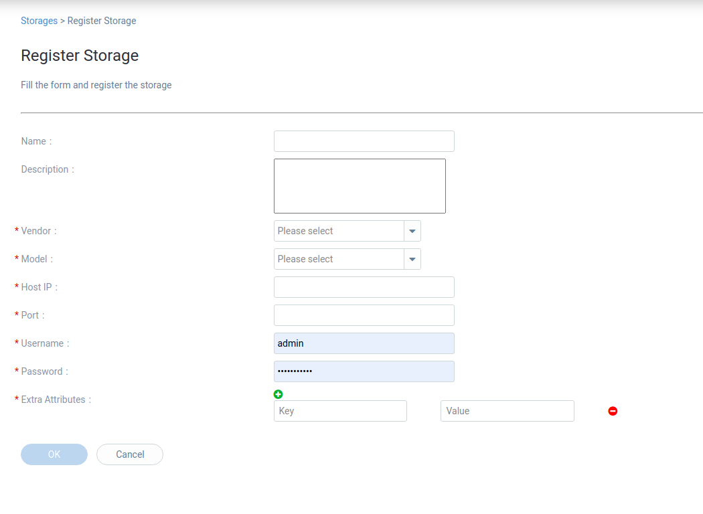
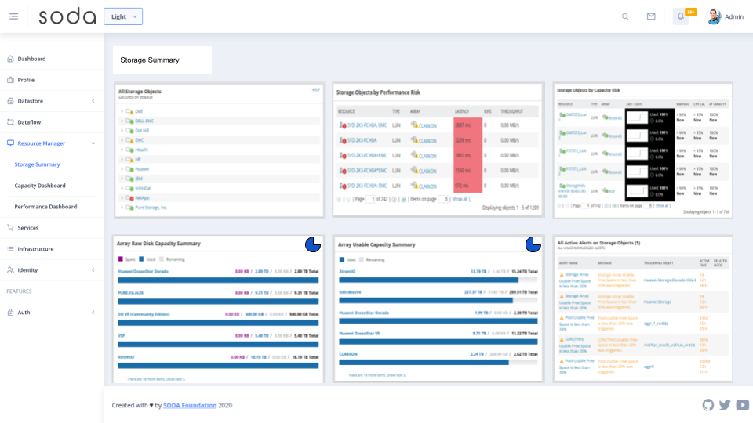
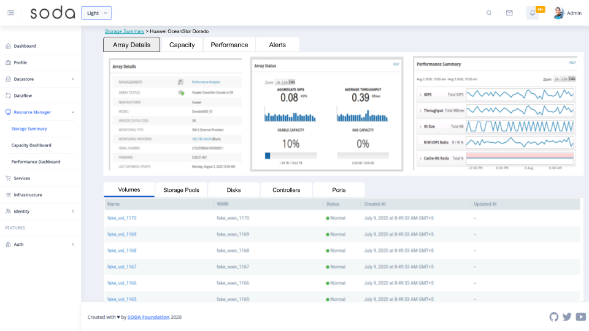
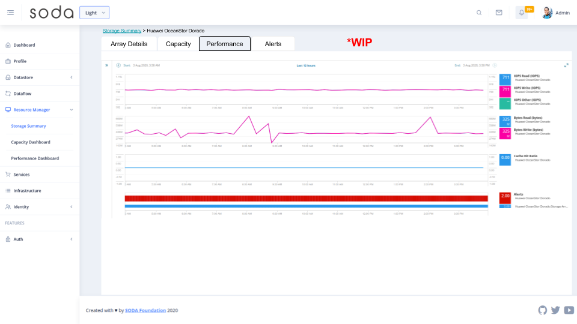

[//]: # (<Please remove this "Notes on this template" part from your actual document. This is for reference START>
Notes on this template:
Please update the sections for which you have the data. Kindly do not remove any section titles. If you do not have the data for the section for now, mark it TBD, if you think, the section is not applicable for your module mark it NA. Please do not change the heading style. You are free to add new sections if you want.
<Please remove this part from your actual document. END>)

  

# Delfin User Interface Requirements & Design

  

**Author(s)**: [Anvith KS](https://github.com/anvithks)

Major Version Updates

|**Date** | **Version** | **Description** |
|---------|-------------|-----------------|
| 18th August 2020  | v0.1  | This document lists the initial requirments and design for the Delfin User interface. |

## Goals
* List the requirements for the Delfin User Interface
* Design the Storage Summary Dashboard
* Design  the Capacity Dashboard
* Design  the Performance Summary Dashboard
* Design  the Alerts notification and Dashboard

## Motivation and background

[//]:# (Describe why this feature? What is the background to develop this etc.)
Administration of heterogeneous platforms is a challenge to storage admins. Vendor supplied management software is either vendor locked in or not open source. SODA foundation has vision to standardise and bring heterogeneous device management using a single platform. Although the command line and APIs provide the user with non graphical interfaces, a graphical user interface will drastically improve the experience of using the above APIs and make the job efficient.

### Non-Goals

[//]:# (What will not be addressed by the proposal?)
* Implementation of UI for modules external to Delfin

### Assumptions and Constraints

[//]:# (What are the assumptions/constraints known)
NA
### Requirement Analysis
One single pane of glass for managing heterogeneous storage devices, switch and host . A standard user interface to manage devices from different vendors and a single source to collect monitoring and alert information from heterogeneous platforms.

#### Storage Summary
---
* Fetch and display Storage devices by Vendor / Model
* Array Details
	* Resources
		* Storage Pools
		* Volumes
		* Controllers
		* Ports
		* Disks
	* Array Capacity Details
	* Array Performance
	* Alerts
* Capacity Usage Summary
* Performance Summary
#### Capacity Dashboard
---
* Overall Capacity dashboard ( aggregated capacity details of all discovered platforms)
* Overall Usable Capacity of registered devices
* Overall raw Capacity of registered devices
* Overall Capacity Usage of registered devices
* Overall Capacity usage across locations (based on availability)
* Overall Capacity Usage by purpose (based on availability)
#### Performance Dashboard
---
* Health status of all the registered devices
* List storage arrays / devices by performance risk
* Display detailed performance information of selected resource (array / pool / volume / disk / controller / port) by metric. 
* Comparison of performance metrics across selected resource.
#### Alerts Dashboard
---
* List and notify about alarms raised across the devices and resources.

### Input Requirements

[//]:# (What are the input requirements for this feature \(can give links to the high level requirements/architecture documents, tasks, analysis etc\) )
* User must be able to register a storage device
  
### Feature Requirements
* Discovery of Storage (auto-discovery or discovery based on Vendor / model selection)
* Overall Capacity dashboard ( aggregated capacity details of all discovered platforms)
* Overall Alert Dashboard (For September release)
* Overall Performance Dashboard (For September release)
* Storage level reports ( configurations, capacity, performance, alert) (for later)
* Customizable performance graphs ( select metrics, time period, etc.)(for later) (depends on availability of historical data)
* Component level reports ( configurations, capacity, performance, alert)(Some in September some for later)

#### Requirement Analysis

[//]:# (Analysis go here)
Analysed tools like: 
* [SolarWinds](http://www.solarwinds.com/network-performance-monitor/registration?program=607&campaign=70150000001Y1rw&CMPSource=DEMO_NPM)
* [Stor2RRD](https://demo.stor2rrd.com/)
#### List of Requirements

[//]:# (Give all the requirements identified for the modules, in different categories)

##### Functional Requirements
-   Registering a storage device
-   Removing a storage device
-   Get registered storage device list
-   Get storage details
-   Querying storage device details
-   Querying other resource Information like (LUN,Pool,Disk, etc)
-   Querying performance metrics of resources and services
-   Register alert source to receive alerts
-   Clear alert
-   Configure resources

##### Non Functional Requirements

Performance Requirements

Security Requirements

Other Non Functional Requirements (Scalability, HA etc…)

  
## Architecture Analysis

### Module Architecture

[//]:# (Module Architecture details go here)

### High Level Module View

[//]:# (Give the overall system architecture and provide the positioning of Module in that. Give the external interfaces, brief description etc…)

### Architecture Tenets

[//]:# (Key strategy, principle of Module architecture. Please add all the inputs from system architecture for the module here...like if overall architecture says the external interface from the module must be REST or the module must be a microservice or the module to be deployed as a lib etc…..So please study the system architecture to provide the details for the module architecture inputs in this section)

  

### High Level Module Architecture

[//]:# (Provide your module architecture with key external interfaces and internal blocks….)

  

## Detailed Design
[//]:# (All the detailed design aspects go here)

### Register Storage Device

### Storage Summary

### Capacity Dashboard

### Storage Array Details

### Use case View

[//]:# (Provide system context and typical use cases to determine the scope and boundaries for the module.)

#### List of Typical Usecases

[//]:# (Provide a list of typical usecases)
 

#### Usecase context model

[//]:# (How is the module in the overall conext of the usecase..typically for a usecase flow...how the module needs to behave...a network diagram with module could help)

#### Interface Model

[//]:# (What are the interfaces for the Modules needed and the view)

##### External Interfaces

[//]:# (Provide the details of the interface, type, why ? any limitations or alternates etc…)

  
#### End User Context

[//]:# (Analysis and design inputs for the end user of the module)

  

### Functional Context

[//]:# (Based on the functional requirements, what are the design aspects to be considered. Give all the details and block diagrams etc..)

 ### Non Functional Context

[//]:# (Based on the non functional requirements, what are the design aspects to be considered. Give all the details and block diagrams etc..)

 #### Performance

[//]:# (What are the design considerations for performance)

#### Security

[//]:# (What are the design considerations for security)

#### Other Non Functional Aspects
[//]:# (What are the design considerations for other non functional requirements)
 

### Data View

#### Data and Control Data Contexts

[//]:# (Provide the details on data and control data flow )

#### Data Model

[//]:# (Data Structures, key points considered, open and alternate points etc…All the data structure to be added here)

  
### Development and Deployment Context

#### Code

[//]:# (Provide inputs for code structure, language, any open source code can be resused, coding methods, development env etc)

 #### Debug Model

[//]:# (how to debug the module, specific logging, debug options etc…)

  
#### Build & Package

[//]:# (How this module is built along with other modules etc…What is the package model)

  #### Deployment

[//]:# (How to install and deploy the module in the system, hardware resource requirements etc. Any other network or such requirements..like client or http server needed etc…)

  
### Execution View

[//]:# (During the run time, any specific aspects to be considered...like logging to be done for the module etc..It is not functional logs, it is specific to the module maintenance; OR Runtime replication or any such requirements to be considered during the design)

  
## Sequence Diagrams

[//]:# (Provide the key control and data flow sequence diagrams here)

  
## Design Alternatives and other notes

[//]:# (If you have any other ideas or alternate suggestions or notes which needs further analysis or later consideration, please add here)
  

## Open Issues

[//]:# (All the open issues go here. Please track it else where to closure)

  
## Design Requirements / Tasks

[//]:# (List of detailed tasks for this module go here. Based on all the design and analysis, please list all the tasks to be completed for the implementation and release of the module. If you are updating the overall task list or location, please provide the links or ids here...This is to get an overall consolidation of task items for this module)

## Scratchpad

[//]:# (All raw inputs or discussion points or etc can be added here)
