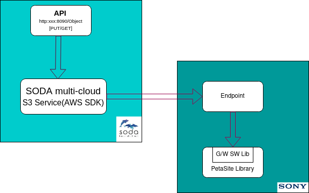
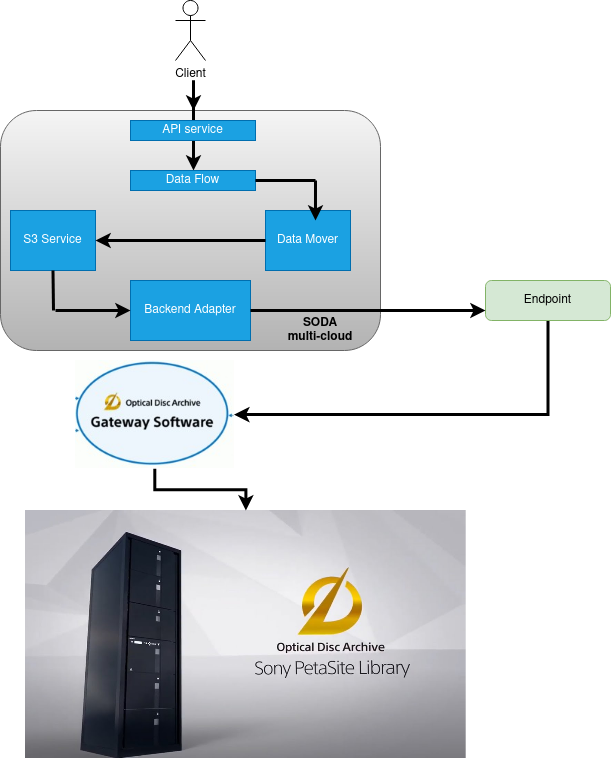
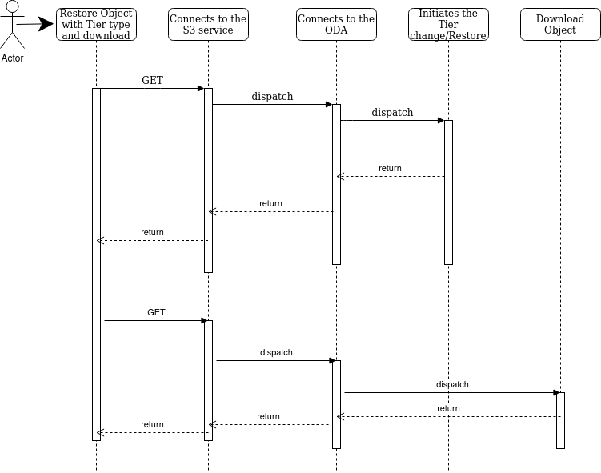

# Cold Storage Support using SONY ODA (Optical Disk Archive)

**Author(s)**: [Ashit Kumar]([https://github.com/kumarashit](https://github.com/kumarashit), [Archana Pathak](https://github.com/Click2cloud-Archana), [Saurabh Gupta](https://github.com/Click2Cloud-SGupta)

Major Version Updates
Date : 02/02/2021 Version : 1.0.0 Description : Ashit Kumar

## Goals
This document contains the requirement and design proposal for Cold Storage/Archival support in SODA using SONY Optical Disk Archive (ODA)

## Motivation and background
Growth of unstructured data and creating an era of big data and artificial intelligence has made archiving essential. This helps in compliance, long term retention and lifecycle management of the data as per Industry regulations.

SONY ODA is:
*“Fast, high-capacity optical disc technology offering several advantages over tape and other long-term cold file storage solutions. It’s ideal for managing rapidly-increasing volumes of data that are characteristic of today’s library, disaster recovery and asset management applications”*

SODA multi-cloud supports archival storage(limited as of now) into public cloud. Adding on-premise archival storage will give the flexibility to archive data on-prem or in-cloud. Also, transitioning objects from Hot to Cold and vice-versa.

### Non-Goals
This document does not consider the Ingress and Egress cost for data movement across the environment. This need to be mostly the onus of the services built over it

### Assumptions and Constraints
TBD

### Requirement Analysis
1.  Support Cold Storage (deep archiving) using SONY ODA
2.  Support retention of data (based upon the storage SLA)
3.  Monitoring of SONY ODA

### Input Requirements
https://drive.google.com/drive/folders/1OblhoueXsUUVNxbdd01_u3-t7s-AvPD2

  
### Feature Requirements
Provide an interface for putting and retrieving data to and from Cold Storage

#### Requirement Analysis
[**REQ1**]: End User can copy or move objects from Hot storage i.e. On-prem Object storage to Cold Storage for Backup or for storage cost optimization.

[**REQ2**]: End User can copy or move objects from Cloud Object Storage to on-premise Cold Storage. Cloud Storage can be standard, high-throughput, low latency storage or an archival/cold storage like AWS Glacier or Azure Cold storage etc.. The purpose of moving/copying the object from Cloud to on-prem can be different, like, Cost optimization, compliance, backup etc..

[**REQ3**]: For compliance and security, SODA should support WORM (ex. object lock in AWS) with proper retention period defined. Currently SONY ODA doesn’t support WORM, so adding this functionality through SODA can prevent object tampering by malicious users and ensure retention, as per the policy

[**REQ4**]: For Compliance, SODA should support “Deep Delete” of objects. Basically, delete with no traces/leftovers

#### List of Requirements
##### Functional Requirements
1.  SONY ODA provides the S3 compatible interface using ODA G/W software library. SODA can use this interface and ODA Endpoint to put data on SONY ODA Cold Storage.   
Users should be able to move data on Cold Storage and retrieve them. SODA becomes the data mover between end-user and the ODA H/W.
SODA can use the S3 compatibility of ODA G/W S/W library
2.  SODA should provide Copy and Move of the Objects. Copy will duplicate the data on source and destination while Move will remove the source object
3.  Copy or Move objects using SODA multi-cloud API in Hybrid Cloud
4.  Provide SODA multi-cloud API to DELETE objects from SONY ODA Cold storage. This deletion should be deep delete which means deleting the object and any metadata involved
5.  Ensure SONY ODA as Backend supported into SODA. Backend registration will accept: Endpoints (which connects to the ODA G/W S/W Library) and Tenant ID (which creates the cartridges)
6.  Ensure WORM for the objects in SODA. Basically SODA managing the Object Lock and pushing the retention period to the SONY ODA
    
##### Non Functional Requirements
1.  Ensure SODA services are HA and avoid any metadata loss
2.  Scale-out the services based upon the volume of data being transitioned

##### Performance Requirements
TBD

##### Security Requirements
TBD

##### Other Non Functional Requirements (Scalability, HA etc…)
TBD

## Architecture Analysis
### Module Architecture

### High Level Module Architecture

#### Direct Upload object to SONY ODA
1. PUT request sent to SODA multi-cloud API service
2. API service authenticates and routes the request to S3 service
3. S3 service connects to SONY ODA Endpoint through the s3 compatible SDK, AWS SDK
4. The request goes to SONY ODA
    
#### Migration across Hot and Cold Storage
1.  Client sends the request to migrate object from Hot Storage to Cold Storage
2.  Dataflow service receives the request and creates plan
3.  Plan is put on kafka
4.  Datamover service reads it from kafka and connects to the backend adapter through S3 service
5.  Backend adapter then connects to the Sony ODA
    
#### Restore/retrieve object from SONY ODA
1.  For retrieving, it’s the GET request sent to the Endpoint which gets the objects based upon SLA

#### Delete object from SONY ODA 
DELETE request is sent through the Endpoint for deleting a particular or a list of objects
SODA request ensures to delete any metadata
    
#### Ensure Software based WORM implementation or Object Lock
1.  End User can send the PUT request with X-AMZ-OBJECT-LOCK set
2.  SODA will keep the metadata for the object as “locked”, once the first time Upload of the object is requested.
**Option**: Add another column in “objects” table, Say ReadOnly. Once the data is persisted on Cold Storage and there is X-AMZ-OBJECT-LOCK request, Set this Column. Any Further modification to the Object can be denied/accepted based upon this Column value to be Set/Unset
3.  Any read request will of-course be a normal operation
    
### Architecture Tenets
TBD

### High Level Module View
TBD

### Use case View
1.  On Prem Archival of objects using SONY ODA (PetaSite Library)
2.  User wants to archive objects on low cost and low TCO media
3.  Long term requirement for multiple purposes like GDPR or Medical data etc..
4.  archive to on-prem or to Cloud

#### List of Typical Usecases
TBD

#### Interface Model
Check the object archival (PUT), retrieval (GET), deletion (DELETE) API spec at:
[https://github.com/sodafoundation/multi-cloud/blob/master/openapi-spec/swagger.yaml](https://github.com/sodafoundation/multi-cloud/blob/master/openapi-spec/swagger.yaml)

#### End User Context
TBD

### Functional Context
TBD

### Non Functional Context
TBD

#### Performance
TBD

#### Security
Check the Functional requirement for Compliance. SODA need to adhere to the compliance and security of the objects being moved/copied. WORM and avoid tampering are some of the design considerations

#### Other Non Functional Aspects
TBD

### Data View
#### Data and Control Data Contexts
TBD

#### Data Model
Add new Column in Objects” table

### Development and Deployment Context
#### Code
TBD

#### Debug Model
TBD

#### Build & Package
No changes 
  
#### Deployment
1.  G/W S/W is deployed as part of customer deployment (No SODA involvement/bundling)
2.  SODA takes care of SODA component installation and resiliency

### Execution View
TBD

## Sequence Diagrams
  
**Archive**

**Restore**  

## Design Alternatives and other notes
N/A

## Open Issues
1.  WORM implementation at SODA level
2.  Deep Delete of Objects
3.  For Cold Storage support, should multi-cloud be the project or multi-cloud be an interface?

