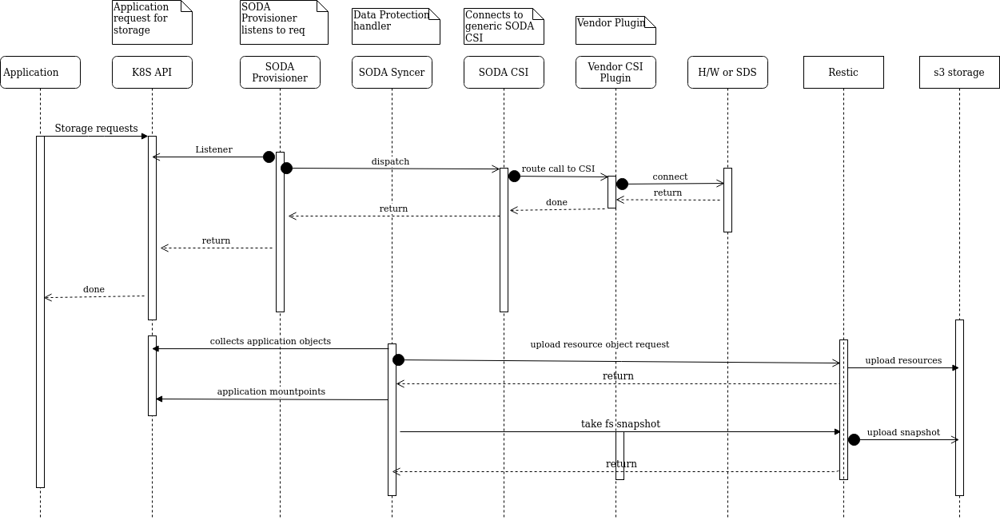

# Data Protection for stateful applications

  
**Author(s)**: [Sanil Kumar D](https://github.com/skdwriting), [Mohammad Asif Siddiqui](https://github.com/asifdxtreme), [Amit Roushan](https://github.com/AmitRoushan), [Ashit Kumar](https://github.com/kumarashit)

Major Version Updates

Date  : Version : Description  : Author

  

## Goals

This is the proposal for creating a solution for Data Protection for stateful applications. It To maintain an uninterrupted availability of containerized applications, Data Protection becomes one of the key strategy. It proposes to create a solution which can:
a) Continuous backup of the applciation data (snapshot based backup)
b) Recover the application incase of DR in distributed environment
c) Migrate in a distributed environment

## Motivation and background

Stateful applications contribute to more than 50% of the enterprise deployment in containerized world. To maintain statefullness and DR, there should be continuos backup of the containerized application data. This will prevent data loss as well as the ability to recover on-demand or as scheduled.

### Non-Goals

This document talks about snapshot based backup and recovery. It doesn't considers any other form of backup as of now. It also talks about the K8S CO and other COs are not yet fully considered. It will be enhanced in future.

### Assumptions and Constraints

TBD

  
### Requirement Analysis

### Input Requirements
Create a vendor agnostic solution for stateful applciation data protection. With data protection, it should have a holistic view of protecting and recovering resources and storages.
Provide intelligent snapshot, snapshot storage and recover

### Feature Requirements

#### Requirement Analysis

#### List of Requirements

A) Stateful application Data Protection
B) Backup of Continaer application resources
C) Migrate applications across K8S cluster as well as in distributed environments
D) Recover applications

##### Functional Requirements
A) Provide APIs for taking continuos backups (on-demand or scheduled)
B) List all available snapshots
C) Snapshots integrated with Provisioned storage to the applications
D) Flexibility to take FS based snapshots or native CSI snapshots
E) Provision to recover or migrate applications in distributed environment in/across clusters
F) Single Click Data Protection

##### Non Functional Requirements

Application performance or I/O should not be affected by snapshots
Crash consistent application backup

Data security while taking backup/snapshot or recover from snapshots

Other Non Functional Requirements (Scalability, HA etc…)

  
## Architecture Analysis

### System Architecture
//Overall Architecture details go here
//Give the overall system architecture and provide the positioning of Module in that. Give the external interfaces, brief description etc…

### Module Architecture

//Module Architecture details go here (each modules as applicable)

### Architecture Tenets
a) In the first cut, SODA will consider the FS snapshot based backup using [restic](https://restic.net/)
b) Next, SODA will consider SODA CSI snapshot based backup to leverage Vendor CSI snapshot features

### High Level Module Architecture

//Provide your module architecture with key external interfaces and internal blocks….

  

## Detailed Design
TBD

### Use case View

//Provide system context and typical use cases to determine the scope and boundaries for the module.

#### List of Typical Usecases

//Provide a list of typical usecases
 

#### Usecase context model

//How is the module in the overall conext of the usecase..typically for a usecase flow...how the module needs to behave...a network diagram with module could help

#### Interface Model

//What are the interfaces for the Modules needed and the view

#### External Interfaces

//Provide the details of the interface, type, why ? any limitations or alternates etc…

  
#### End User Context

//Analysis and design inputs for the end user of the module

  

### Functional Context

//Based on the functional requirements, what are the design aspects to be considered. Give all the details and block diagrams etc..

 ### Non Functional Context

//Based on the non functional requirements, what are the design aspects to be considered. Give all the details and block diagrams etc..

 #### Performance

//What are the design considerations for performance

#### Security

//What are the design considerations for security

#### Other Non Functional Aspects
//What are the design considerations for other non functional requirements
 

### Data View

#### Data and Control Data Contexts

//Provide the details on data and control data flow 

#### Data Model

Data Structures, key points considered, open and alternate points etc…All the data structure to be added here

  
### Development and Deployment Context

#### Code

//Provide inputs for code structure, language, any open source code can be resused, coding methods, development env etc

 #### Debug Model

//how to debug the module, specific logging, debug options etc…

  
#### Build & Package

//How this module is built along with other modules etc…What is the package model

  #### Deployment

//How to install and deploy the module in the system, hardware resource requirements etc. Any other network or such requirements..like client or http server needed etc…

  
### Execution View

//During the run time, any specific aspects to be considered...like logging to be done for the module etc..It is not functional logs, it is specific to the module maintenance; OR Runtime replication or any such requirements to be considered during the design

  
## Sequence Diagrams

  
## Design Alternatives and other notes

//If you have any other ideas or alternate suggestions or notes which needs further analysis or later consideration, please add here
  

## Open Issues

//All the open issues go here. Please track it else where to closure

  
## Design Requirements / Tasks

//List of detailed tasks for this module go here. Based on all the design and analysis, please list all the tasks to be completed for the implementation and release of the module. If you are updating the overall task list or location, please provide the links or ids here...This is to get an overall consolidation of task items for this module

## Scratchpad

//All raw inputs or discussion points or etc can be added here
