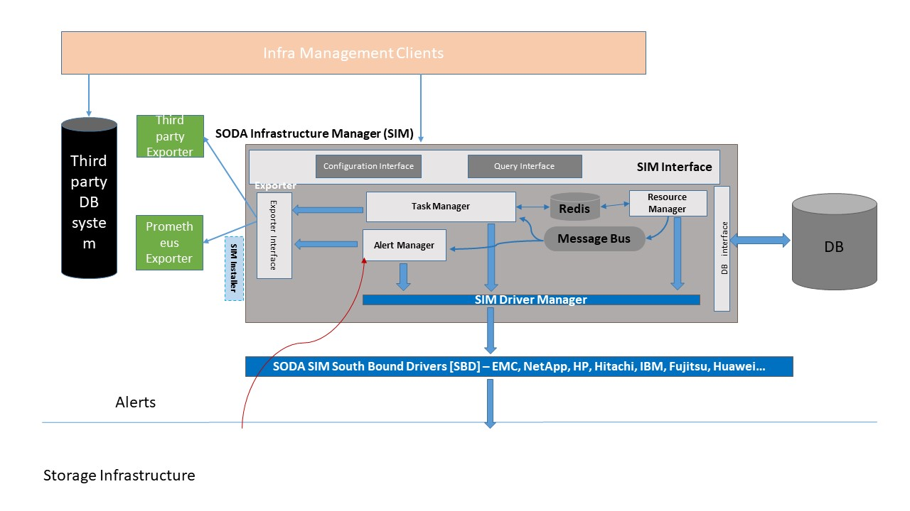
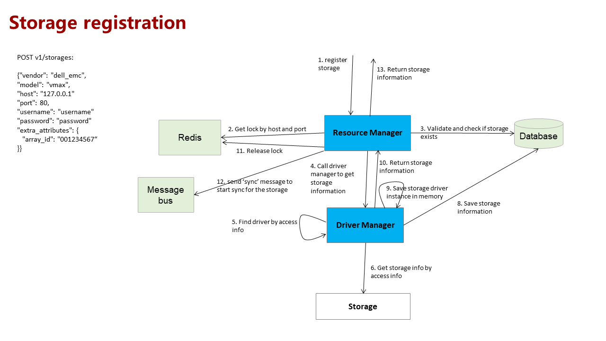
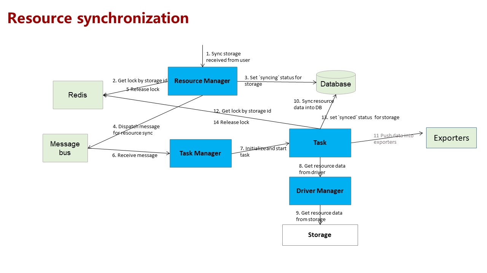
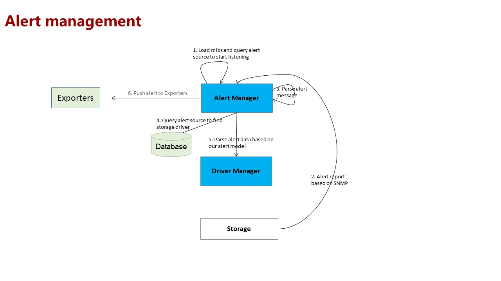


# SODA Infrastructure Manager (delfin) Design Document
**Authors:** [Najmudheen CT](https://github.com/NajmudheenCT), [Sanil Kumar D](https://github.com/skdwriting), [Xulin](https://github.com/wisererik),  [Ashit Kumar](https://github.com/kumarashit)

This documentation serves as the design spec for SODA Infrastructure Management
## Goal
To build an open source infrastructure management platform for heterogeneous storage environments. 
* Framework for heterogeneous resource management 
* APIS for storage resource monitoring and alerts
* Common storage resource models

## Non-Goals
* GUI for infrastructure management.
* Performance metric models
* Switch and Host discover requirements
* Switch and Host models
* Resource configuration requirements and design
* deployment model

## Assumptions and Constraints
NA
## Motivation and background
Today’s IT infrastructure spans across multi vendor devices and technologies. Administration of heterogeneous platforms is a challenge to storage admins.  Vendor supplied management software is either vendor locked in or not open source.  SODA foundation has vision to standardize and bring heterogeneous device management using a single platform.

## Requirement Analysis

One single pane of glass for managing heterogeneous storage devices, switch and host . A standard API model to manage devices from different vendors and a single source to collect monitoring and alert information from heterogeneous platforms.  
### Storage Discovery Requirements
#### Storage Discovery:-
User should be able to add supported device models to the system for discovery
#### Storage Monitoring and Alerts: 
Get basic storage information, hardware information, logical resources information, alert information , performance information  and configure resources and services in the storage device. 

### Feature Requirements
#### Requirement Analysis
Analyzed Open Source monitoring solution.

1.	 [Stor2rrd](https://www.stor2rrd.com/) is an available free solution with an rrd tool to persist metrics.

#### List of Requirements
##### Functional Requirements
* Registering a storage device
* Removing a storage device
* Get registered storage device list
* Updating storage device access information
* Get storage details
* Querying storage device details
* Querying other resource  Information like (LUN,Pool,Disk, etc)
* Querying performance metrics of resources and services
* Trigger all registered  device collection
* Trigger a particular  device  collection
* Register alert source to receive alerts
* Receive alert and forward to clients
* Clear alert
* Configure resources

##### Non Functional Requirements
* Performance requirements
* Security requirements
* Other non functional requirements (scalability  , HA etc…)


## Architecture Analysis
### High level Architecture



###  Interfaces
Provides the standardization for Infrastructure Management APIs. This is the interface for third party management platforms to avail heterogeneous devices Infra Management services.
* Configuration Interface:
These are the REST interfaces to register/create/modify resources . 
* Query Interfaces : These are the REST interfaces to get information (capacity, performance, alert)

* Exporter Interface : Provides class interfaces for the external exporters to get data from SIM to third party platforms.
* DB Interface : Provides interfaces to access DB 

### Resource Manager
Act as the API server for all REST requests . Resource Manager takes care of resource creation, modification , alert source creation, and user request for  syncing registered storages with SIM DB.

### Task Manager
Responsible for managing all retrievals (resource and performance information) . Uses a message bus to receive tasks form either Resource manager or from configured cron job.

### Alert Manager
Responsible for keeping source info and MIBs who registered for alert notification. Receive traps from back ends, receive alerts from internal Infra Management services. Responsible for   process and normalize the alert and  notify/send to  clients. Alert parsing is platform specific, hence this functionality can be taken by the driver.
Alert manger will internally have :

●	Trap receiver module: for receiving SNMP trap from back ends

●	Alert forwarder : forward normalized alerts to registered clients 

### Driver Manager 
Responsible for creating driver instance for each backend and select appropriate driver  for each request from above layers.

### Drivers
Responsible for connecting to back end devices/platforms to configure and collect data 

## Use case view
### List of Typical Use cases
1.	Storage Administrator register a new device for management. 
2.	Storage Administrator/tenant queries list of resources discovered.
3.	Storage Administrator/tenant queries performance metric for a resource for a time range  
4.	Storage Administrators configure resources or services.
5.	Storage Administrator/tenant get notified for any alert in the system
6. Storage Administrator modifies storage access information 


## Sequence Diagrams
### Storage registration


### Resource synchronization 



### Alert source configuration


### Alert management



## Interface Model
### REST APIs 
[Openapi spec swaager](https://github.com/sodafoundation/delfin/blob/master/openapi-spec/swagger.yaml)
### Exporter interfaces
```
def dispatch_data(self, data):
        """Dispatch data to north bound platforms.
            :param data: Resource data.
            :type data: dict
            Redefine this in child classes.
        """
def dispatch_alert_model(self, alert_model):
        """Dispatch data to north bound platforms.
            :param alert_model: Alert model.
            :type alert_model: dict
            Redefine this in child classes.
        """
```
### DB Interfaces
[DB interfaces](https://github.com/sodafoundation/delfin/blob/master/delfin/db/api.py)

## Data Model
### Storage
| Attribute        | Data Type   | Unit  | Enumerated Value | Description                              | Version |
|------------------|-------------|-------|------------------|------------------------------------------|---------|
| id               | uuid(36)    |       |                  | Indicates the delfin system resource ID. |         |
| name             | string(255) |       |                  | Device Name                              |         |
| description      | string(255) |       |                  | Device Description                       |         |
| status           | enum(255)   |       |                  | Device Status                            |         |
|                  |             |       | normal           | Normal                                   |         |
|                  |             |       | offline          | Offline                                  |         |
|                  |             |       | abnormal         | Fault                                    |         |
| vendor           | string(255) |       |                  | Vendor                                   |         |
| model            | string(255) |       |                  | Device Model                             |         |
| serial_number    | string(255) |       |                  | Serial number                            |         |
| firmware_version | string(255) |       |                  | Firmware Version                         |         |
| location         | string(255) |       |                  | Device location                          |         |
| total_capacity   | integer     | Bytes |                  | Total Capacity                           |         |
| used_capacity    | integer     | Bytes |                  | Used Capacity                            |         |
| free_capacity    | integer     | Bytes |                  | Available Capacity                       |         |
| used_capacity    | integer     | Bytes |                  | Used Capacity                            |         |


### Storage Pool
| Attribute              | Data Type   | Unit  | Enumerated Value | Description                              | Version |
|------------------------|-------------|-------|------------------|------------------------------------------|---------|
| id                     | uuid(36)    |       |                  | Indicates the delfin system resource ID. |         |
| name                   | string(255) |       |                  | Name                                     |         |
| description            | string(255) |       |                  | Description                              |         |
| status                 | enum        |       |                  | Status                                   |         |
|                        |             |       | normal           | Normal                                   |         |
|                        |             |       | offline          | Offline                                  |         |
|                        |             |       | abnormal         | Fault                                    |         |
| storage_type           | enum        |       |                  | Type                                     |         |
|                        |             |       | block            | Block storage pool                       |         |
|                        |             |       | file             | File storage pool                        |         |
|                        |             |       | mix              | Hybrid storage pool, supporting blocks and files |         |
| total_capacity         | integer     | Bytes |                  | Total Capacity                           |         |
| used_capacity          | integer     | Bytes |                  | Used Capacity                            |         |
| free_capacity          | integer     | Bytes |                  | Available Capacity                       |         |
| native_storage_pool_id | string(255) |       |                  | Specifies the storage pool ID on the device. |         |
| storage_id             | uuid(36)    |       |                  | Storage:id in the delfin system         |         |


### Volume

| Attribute              | Data Type   | Unit  | Enumerated Value | Description                              | Version |
|------------------------|-------------|-------|------------------|------------------------------------------|---------|
| id                     | uuid(36)    |       |                  | Indicates the delfin system resource ID. |         |
| name                   | string(255) |       |                  | Name                                     |         |
| description            | string(255) |       |                  | Description                              |         |
| status                 | enum        |       |                  | Status                                   |         |
|                        |             |       | normal           | Normal                                   |         |
|                        |             |       | offline          | Offline                                  |         |
|                        |             |       | abnormal         | Fault                                    |         |
| type                   | enum        |       |                  | Logical Type                             |         |
|                        |             |       | thick            | Common LUN                               |         |
|                        |             |       | thin             | Thin LUN                                 |         |
| wwn                    | string(255) |       |                  | WWN                                      |         |
| total_capacity         | integer     | Bytes |                  | Total Capacity                           |         |
| used_capacity          | integer     | Bytes |                  | Used Capacity                            |         |
| free_capacity          | integer     | Bytes |                  | Available Capacity                       |         |
| compressed             | boolean     |       |                  | Whether deduplication is supported       |         |
| deduplicated           | boolean     |       |                  | Whether to support compression           |         |
| native_volume_id       | string(255) |       |                  | LUN ID on the device                     |         |
| native_storage_pool_id | string(255) |       |                  | Specifies the ID of the owning storage pool on the device. |         |
| storage_id             | uuid(36)    |       |                  | Storage:id in the delfin system         |         |


### Alert model
| Attribute      | Data Type    | Unit         | Enumerated Value                         | Constraint Level | Description                              |
|----------------|--------------|--------------|------------------------------------------|------------------|------------------------------------------|
| category       | Enum(int)    |              |                                          | Mandatory        | Type of the reported alarm notification  |
|                |              |              | 1:New                                    |                  |                                          |
|                |              |              | 2:Fixed                                  |                  |                                          |
|                |              |              | 3:Removed                                |                  |                                          |
|                |              |              | 4:Recovered                              |                  |                                          |
|                |              |              | 5:Alarm acknowledgement change           |                  |                                          |
|                |              |              | 6:Alarm unacknowledgement                |                  |                                          |
|                |              |              | 7:Other change                           |                  |                                          |
| occurUtcTime   | long         | milliseconds |                                          | Mandatory        | UTC time when the alarm is generated (in milliseconds) |
| matchKey       | String(255)  |              |                                          | Mandatory        | Alarm matching key                       |
| meDn           | String(255)  |              |                                          | Not              | Unique Id of alarm source device in the whole management system. |
| meName         | String(255)  |              |                                          | Mandatory        | Alarm source which identifies the device that generates an alarm. Alarm source can be identified by the device name and IP address. |
| nativeMeDn     | String(255)  |              |                                          | Mandatory        | Unique Id of device in source system.    |
| moi            | String(255)  |              |                                          | Mandatory        | Managed object instance which specifies location information. |
| eventType      | String(255)  |              |                                          | Mandatory        | Basic classification of the alarm        |
| alarmName      | String(255)  |              |                                          | Mandatory        | Name of the alarm                        |
| alarmId        | String(255)  |              |                                          | Mandatory        | Identification of alarm                  |
| severity       | Enum(int)    |              |                                          | Mandatory        | Severity of the alarm                    |
|                |              |              | 1: Critical                              |                  |                                          |
|                |              |              | 2: Major                                 |                  |                                          |
|                |              |              | 3: Minor                                 |                  |                                          |
|                |              |              | 4: Warning                               |                  |                                          |
| deviceAlertSn  | String(255)  |              |                                          | Not              | Sequence number of interconnected system |
| manufacturer   | String(255)  |              |                                          | Mandatory        | Vendor of the device                     |
| productName    | String(255)  |              |                                          | Mandatory        | Product name                             |
| probabaleCause | String(255)  |              |                                          | Not              | Possible cause description               |
| clearType      | Enum(int)    |              |                                          | Mandatory        | Alarm clearance type                     |
|                |              |              | 0: Uncleared                             |                  |                                          |
|                |              |              | 1: Normal Clearance(means recovered)     |                  |                                          |
|                |              |              | 2: Reset clear(when device restarts, device checks if fault occurs again, original fault cleared) |                  |                                          |
|                |              |              | 3: Manually clear the alarm              |                  |                                          |
|                |              |              | 4: Configuration clearance(alarm cleared because object/configuration is delete from system) |                  |                                          |
|                |              |              | 5: Correlation clearance(some other alarm clearance causes this alarm clearance) |                  |                                          |
|                |              |              | 6: System Clearance(system clearance due to management capacity limitations) |                  |                                          |
|                |              |              | 7: Synchronous clearance(Clearance due to interconnected system) |                  |                                          |
| meCategory     | Enum(String) |              |                                          | Mandatory        | Resource category                        |
|                |              |              | Network                                  |                  |                                          |
|                |              |              | Server                                   |                  |                                          |
|                |              |              | Storage                                  |                  |                                          |


