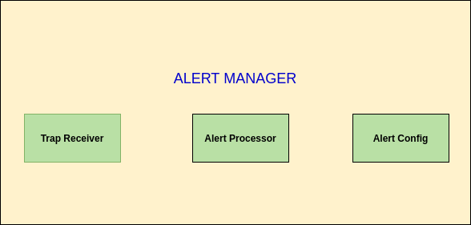
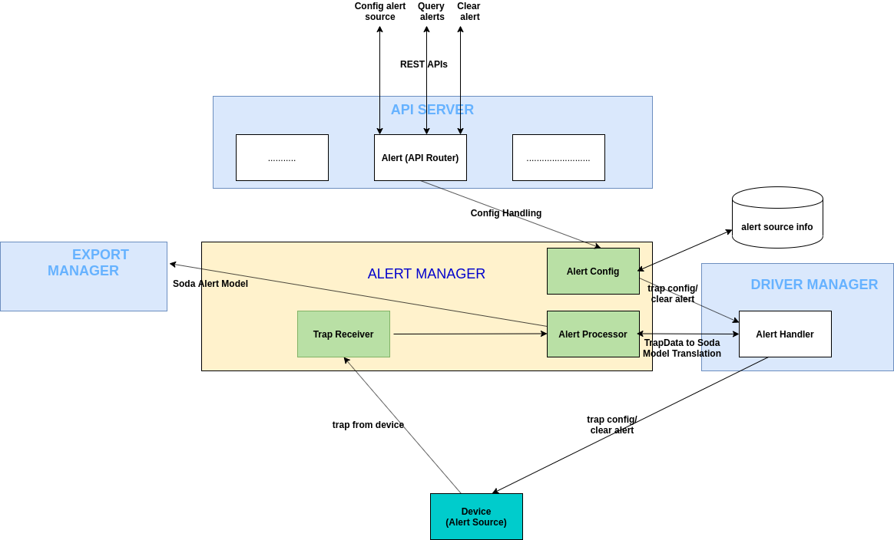

# SODA Alert Manager Design Document
**Authors:** [Sushantha Kumar](https://github.com/sushanthakumar), [Shufang Zeng](https://github.com/sfzeng)

This documentation serves as the design spec for Alert manager module of SODA Infrastructure Management
## Goal
This document will propose the key aspects of alert manager, its key requirements, interfaces, data model and low level design details involving sequence diagrams for major flows

## Non-Goals
This design does not cover the deployment model or the way in which this module will be installed with other modules of infra management framework 

## Assumptions and Constraints
* SNMP also supports informs which are similar to traps but need acknowledgement from the manager to ensure guaranteed delivery. This design does not consider the support for SNMP informs.
* SNMP v2c/v3 configuration need to be done at device side also which will be taken care by Administrator

## Requirement Analysis
### Input Requirements
Send alarms received from registered devices to third party managers

Clear alarm from backend as specified by manager

Manage alert source configuration

Query alarms from backend as specified by manager

### Feature Requirements
#### Functional Requirements
##### Support listener for traps
|  |  |
|-----------------|---------------------------|
| Brief Description    | Initialization and start of trap listener |
| Precondition       | None |
| Input     | Trigger for Module startup  |
| Key Processings     | Initialize the parameters needed to start the listener |
|                     | Open listen socket at speficied address and port |
|                     | Continously listen for incoming traps |
| Output    | Trap listener is up and running for any incoming traps  |
| Priority     | High |
| Remarks     | None |

##### Process incoming SNMP traps
|  |  |
|-----------------|---------------------------|
| Brief Description    | Processing SNMP V2c/V3 traps received from devices |
| Precondition       | Trap server is running on given port |
| Input     | SNMP trap received at trap server  |
| Key Processings     | Validate incoming trap wrt its version |
|                     | Parse trap content using loaded MIB information |
|                     | Convert trap info to SODA Alert model |
|                     | Push alert to exporter for sending out |
| Output    | Trap is processed and alert is sent to exporter  |
| Priority     | High |
| Remarks     | By default, trap receiver is up and listening for traps |

##### Clear specified alarm
|  |  |
|-----------------|---------------------------|
| Brief Description    | Clearing particular alarm specified by user  |
| Precondition       | Module is up and alarms are received |
| Input     | Details of alarm to be cleared  |
| Key Processings     | Event received by alert config |
|                     | Parse and get details of alarm to be cleared |
|                     | Trigger alarm clear from back end |
| Output    | Input alarm is cleared at backend  |
| Priority     | High |
| Remarks     | None |

##### Add alert source configuration
|  |  |
|-----------------|---------------------------|
| Brief Description    | Configuring alert source for SNMP V2c/V3 user for processing traps |
| Precondition       | Module is up |
| Input     | Alert source configuration from admin  |
| Key Processings     | Validate input alert source wrt its version |
|                     | Add alert source details to DB |
|                     | Validate configuration by connecting to backend using snmp get operation |
|                     | Update trap receiver with alert source config |
| Output    | Input alert source is saved to database and trap receiver is updated accordingly to handle traps |
| Priority     | High |
| Remarks     | None|

##### List alert source configuration
|  |  |
|-----------------|---------------------------|
| Brief Description    | Listing all configured alert sources |
| Precondition       | Module is up |
| Input     | List alert source request from admin  |
| Key Processings     | Validate input query request |
|                     | Return the list of all alert sources from DB |
| Output    | List of all alert sources|
| Priority     | High |
| Remarks     | None|

##### Delete alert source configuration
|  |  |
|-----------------|---------------------------|
| Brief Description    | Deleting already configured alert source |
| Precondition       | Module is up |
| Input     | Delete Alert source configuration request from admin  |
| Key Processings     | Validate input alert source delete request |
|                     | Delete alert source details from DB |
|                     | Remove alert source config details from trap receiver side |
| Output    | Input alert source configuration is deleted from database |
| Priority     | High |
| Remarks     | None|

##### Update alert source configuration
|  |  |
|-----------------|---------------------------|
| Brief Description    | Updating existing alert source configuration |
| Precondition       | Module is up |
| Input     | Update Alert source configuration request from admin  |
| Key Processings     | Validate input alert source wrt its version |
|                     | Update alert source details to DB |
|                     | Update trap receiver with alert source config |
| Output    | Input alert source is updated to database and trap receiver is updated accordingly to handle traps |
| Priority     | High |
| Remarks     | None|

##### Query alarms from specified backend
|  |  |
|-----------------|---------------------------|
| Brief Description    | Querying of alarms from the specified backend  |
| Precondition       | Module is up |
| Input     | Details of backend whose alarms need to be queried  |
| Key Processings     | API request received by user |
|                     | Validate request |
|                     | Trigger the query interface of backend and collect all current alarms |
|                     | Convert the collected alarms to SODA Alert model |
|                     | Provide the list of alarms as response |
| Output    | List of alarms queried from backend |
| Priority     | High |
| Remarks     | None |

##### Synchronize alarms from specified backend
|  |  |
|-----------------|---------------------------|
| Brief Description    | Synchronizing alarms from the specified backend to exporters |
| Precondition       | Module is up |
| Input     | Details of backend whose alarms need to be synchronized  |
| Key Processings     | API request received by user |
|                     | Validate request |
|                     | Trigger the query interface of backend and collect all current alarms |
|                     | Convert the collected alarms to SODA Alert model |
|                     | Push alarm list to exporter for sending out |
| Output    | List of alarms pushed to exporter |
| Priority     | High |
| Remarks     | None |

#### Non Functional Requirements
NA

## Architecture Analysis
### SODA Infrastructure Manager: High Level View
[Refer here](https://github.com/sodafoundation/architecture-analysis/blob/master/arch-design/delfin/resources/Architecture.jpg)

### High Level Module Architecture

#### Submodules
* Trap Receiver : Listens and handles incoming traps
* Alert Processor: Parses using MIB info, converts to soda model, sends to exporter
* Alert Config : Exposes external interface and handles config part

## Detailed Design
### Intermodule interaction diagram

### Interface Design
#### Interfaces consumed by Alert Manager
|  Provider | Interfaces |
|-----------------|---------------------------|
| Export Manager   | Name: DispatchToExportManager |
|                  | Description: To push soda alert module to third party |
|                  | Input: soda alert model |
|                  | Output: Success/Failure |
| Driver Manager   | Name: ParseAlert |
|                  | Description: To process trap data and convert to soda alert model |
|                  | Input: backend info and trap data |
|                  | Output: Soda alert model |
| Driver Manager   | Name: ListAlerts |
|                  | Description: To get all alerts from given backend |
|                  | Input: backend info |
|                  | Output: Success/Failure |
| Driver Manager   | Name: ClearAlert |
|                  | Description: To clear the alert for the input sequence number from device side |
|                  | Input: backend info and alert sequence number |
|                  | Output: Success/Failure |

#### Interfaces exposed by Alert Manager
|  Consumer | Interfaces |
|-----------------|---------------------------|
| Task manager | Name: SyncSnmpConfig |
|              | Description: To process alert source configuration and update snmp trap listener |
|              | Input: alert source configuration |
|              | Output: Success/Failure |
| Task manager | Name: CheckSnmpConfig |
|              | Description: To check if the snmp configuration is valid to connect to backend at any point of time |
|              | Input: alert source configuration |
|              | Output: Success/Failure |

### Alert API model

Swagger Reference (https://github.com/sodafoundation/delfin/blob/master/openapi-spec/swagger.yaml)

### Data Model
* AlertSourceInfo: All the information about the alert source device which will be stored in DB

* AlertModel: Soda alert model which will be pushed to export manager after complete processing of trap

| Attribute      | Data Type    | Enumerated Value                         |Description                              |
|----------------|--------------|------------------------------------------|------------------------------------------|
| storage_id     | String(255)  |                                          | Unique identification for the storage backend                 |
| storage_name   | String(255)  |                                          | Name of the storage backend                   |
| vendor         | String(255)  |                                          | Manufacturer of the storage backend                    |
| model          | String(255)  |                                          | Model of the storage backend                 |
| serial_number  | String(255)  |                                          | Serial number of the storage backend                   |
| alert_id       | String(255)  |                                          | Unique identification for a given alert type                  |
| alert_name     | String(255)  |                                          | Unique name for a given alert type       |
| severity       | Enum(String) |                                          | Severity of the alert                    |
|                |              | Fatal                                    |                                          |
|                |              | Critical                                 |                                          |
|                |              | Major                                    |                                          |
|                |              | Minor                                    |                                         |
|                |              | Warning                                  |                                         |
|                |              | Informational                            |                                         |
|                |              | NotSpecified                             |                                         |
| category       | Enum(String) |                                          | Category of alert generated              |
|                |              | Fault                                    |                  |                                          |
|                |              | Event                                    |                  |                                          |
|                |              | Recovery                                 |                  |                                          |
|                |              | NotSpecified                             |                  |                                          |
| type           | Enum(String) |                                          | Type of the alert generated              |
|                |              | CommunicationsAlarm                      |                                          |
|                |              | EquipmentAlarm                           |                                          |
|                |              | ProcessingErrorAlarm                     |                                          |
|                |              | QualityOfServiceAlarm                    |                                         |
|                |              | EnvironmentalAlarm                       |                                        |
|                |              | IntegrityViolation                       |                                          |
|                |              | OperationalViolation                     |                                          |
|                |              | PhysicalViolation                        |                                          |
|                |              | SecurityServiceOrMechanismViolation      |                                          |
|                |              | TimeDomainViolation                      |                                         |
|                |              | NotSpecified                             |                                        |
| sequence_number| String(255)  |                                          | Sequence number for the alert            |
| occur_time     | long         |                                          | Time at which alert is generated from device in epoch format |
| description    | String(255)  |                                          | Possible cause description or other details about the alert               |
| recovery_advice| String(255)  |                                          | Some suggestion for handling the given alert|
| resource_type  | Enum(String) |                                          | Resource type of device/source generating alert                        |
|                |              | Network                                  |                                          |
|                |              | Server                                   |                                          |
|                |              | Storage                                  |                                          |
| location       | String(255)  |                                          | Detailed info about the tracing the alerting device such as slot, rack, component, parts etc |

### Sequence Diagrams
* Configuring alert source

* Processing incoming traps

* Clearing alert

### Deployment
* Alert manager runs as a seperate process and interacts with api and task manager processes.
* Alert manager can be deployed in multiple nodes as seperate processes

